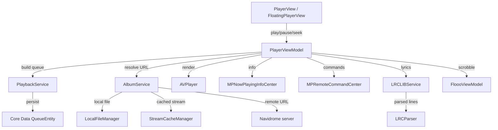

# Audio playback

**Active contributors:** rizaldy, docmeth02, Piekay, Francesco, faultables, SindreKjelsrud, Ed Poe, Simon Risse

**Purpose:** The audio playback feature lets users play songs, albums, playlists, and live radio from a Navidrome server. It also supports lyrics, AirPlay, remote controls from the lock screen and Control Center, and several playback modes.

## Directory layout

```
/home/exedev/flo/flo
├── PlayerViewModel.swift
├── PlayerView.swift
├── FloatingPlayerView.swift
├── LyricsView.swift
└── Shared
    ├── Models
    │   ├── Playable.swift
    │   ├── NowPlaying.swift
    │   └── LyricsLine.swift
    ├── Services
    │   ├── PlaybackService.swift
    │   └── LRCLIBService.swift
    └── Utils
        ├── AirPlayRoutePicker.swift
        └── LRCParser.swift
```

## Key abstractions

| Type | File | Description |
|------|------|-------------|
| `PlayerViewModel` | `/home/exedev/flo/flo/PlayerViewModel.swift` | Singleton view model that owns the `AVPlayer`, the queue, and playback state. |
| `PlaybackService` | `/home/exedev/flo/flo/Shared/Services/PlaybackService.swift` | Converts `Playable` items into persisted `QueueEntity` records and shuffles queues. |
| `Playable` | `/home/exedev/flo/flo/Shared/Models/Playable.swift` | Protocol that represents anything that can produce a queue, such as `Album`, `Playlist`, and `SongCollection`. |
| `QueueEntity` | Core Data model | Core Data entity stored in the persistent queue. Used to restore the queue across launches. |
| `NowPlaying` | `/home/exedev/flo/flo/Shared/Models/NowPlaying.swift` | Lightweight Codable model for playback metadata. |
| `PlayerView` | `/home/exedev/flo/flo/PlayerView.swift` | Full-screen player with artwork, transport, queue, and lyrics modes. |
| `FloatingPlayerView` | `/home/exedev/flo/flo/FloatingPlayerView.swift` | Compact glass-morphism bar that appears above the tab bar when something is playing. |
| `LyricsView` | `/home/exedev/flo/flo/LyricsView.swift` | Time-synced lyrics display with scroll-to-current-line behavior. |
| `LRCLIBService` | `/home/exedev/flo/flo/Shared/Services/LRCLIBService.swift` | Fetches lyrics from a user-configured LRCLIB server. |
| `LRCParser` | `/home/exedev/flo/flo/Shared/Utils/LRCParser.swift` | Parses synced LRC lyrics into `[LyricsLine]`. |
| `AirPlayRoutePicker` | `/home/exedev/flo/flo/Shared/Utils/AirPlayRoutePicker.swift` | SwiftUI wrapper around `AVRoutePickerView` for AirPlay selection. |

## How it works

The player is built around a single `AVPlayer` instance managed by the `PlayerViewModel` singleton. When a user chooses to play an album, playlist, song, or radio, the view model asks `PlaybackService` to create a `QueueEntity` queue, persists it through Core Data, and then calls `setNowPlaying` to load the active stream.

Streaming uses the URL returned by `AlbumService.getStreamUrl`. That method checks for a local download first, then a cached stream, and finally falls back to a remote Subsonic stream URL with the selected bit rate and format. The periodic time observer updates the progress label, saves the current progress to `UserDefaults`, triggers a scrobble once the track passes 50 percent, and starts pre-caching the next song after 10 seconds of playback.

The Now Playing info shown on the lock screen is kept in sync with `MPNowPlayingInfoCenter`, and `MPRemoteCommandCenter` handles external play, pause, next, previous, and seek commands. Audio route changes and interruptions are observed through `AVAudioSession` notifications.



## Playback modes

The player supports three modes that cycle when the user taps the repeat button:

1. `defaultPlayback` — Play through the queue once and stop at the end.
2. `repeatAlbum` — Repeat the whole queue when the last track finishes.
3. `repeatOnce` — Repeat the current track forever.

`shuffleCurrentQueue` toggles shuffle mode by either keeping the original queue from `PlaybackService.getQueue` or shuffling the tail after the current index.

## Live radio

Live radio stations are not persisted to the queue. `playRadioItem` creates a single-item queue with a remote `AVPlayerItem` from the station URL, marks the track as live by checking for an infinite or NaN duration, and hides the seek bar and queue controls in the UI.

## Lyrics via LRCLIB

If the user has configured an LRCLIB server URL, `PlayerViewModel.fetchLyrics` calls `LRCLIBService` with the track name, artist, optional album, and duration. Synced lyrics are parsed by `LRCParser` and displayed by `LyricsView`, which scrolls to the active line and lets the user seek by tapping a line.

## Integration points

| Direction | What |
|-----------|------|
| Imports / calls | `AlbumService`, `PlaybackService`, `FloooViewModel`, `LRCLIBService`, `LRCParser`, `StreamCacheManager`, `LocalFileManager`, `CoreDataManager`, `UserDefaultsManager`, `AVAudioSession`, `MPNowPlayingInfoCenter`, `MPRemoteCommandCenter` |
| Called by | `AlbumView`, `PlaylistDetailView`, `SongsView`, `SongView`, `LikedSongsView`, `CachedSongsView`, `RadiosView`, `ArtistDetailView`, `CarPlayCoordinator`, `PlaybackCoordinator`, `WatchPlayerViewModel` |
| Emits | Now Playing metadata updates, playback progress, scrobble events, route-change notifications |
| Listens to | `AVAudioSession.interruptionNotification`, `AVAudioSession.routeChangeNotification`, `MPRemoteCommandCenter` events |

## Entry points for modification

- To change how queues are built or persisted, edit `PlaybackService.addToQueue` and the Core Data model.
- To change the full-screen player UI or add new controls, edit `PlayerView.swift` and the `@Published` state in `PlayerViewModel`.
- To support a different lyrics provider, replace `LRCLIBService` or add a new fetch path inside `PlayerViewModel.fetchLyrics`.

## Key source files

| File | Responsibility |
|------|----------------|
| `/home/exedev/flo/flo/PlayerViewModel.swift` | Central player state, `AVPlayer` management, remote command center, scrobbling, lyrics, and queue handling. |
| `/home/exedev/flo/flo/PlayerView.swift` | Full-screen player UI, queue sheet, transport controls, and lyrics presentation. |
| `/home/exedev/flo/flo/FloatingPlayerView.swift` | Compact now-playing bar shown across the app. |
| `/home/exedev/flo/flo/LyricsView.swift` | Time-synced lyrics rendering. |
| `/home/exedev/flo/flo/Shared/Services/PlaybackService.swift` | Queue persistence and shuffle logic. |
| `/home/exedev/flo/flo/Shared/Models/Playable.swift` | `Playable` protocol and `SongCollection` helper. |
| `/home/exedev/flo/flo/Shared/Utils/AirPlayRoutePicker.swift` | AirPlay route picker SwiftUI wrapper. |
| `/home/exedev/flo/flo/Shared/Utils/LRCParser.swift` | LRC lyric parser. |
| `/home/exedev/flo/flo/Shared/Services/LRCLIBService.swift` | LRCLIB network client. |
| `/home/exedev/flo/flo/Shared/Models/NowPlaying.swift` | Now-playing metadata model. |
