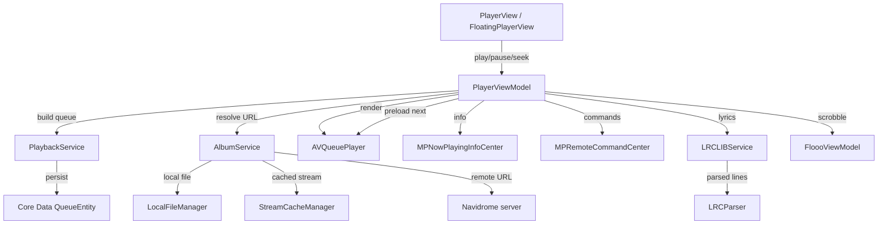

# Audio playback

**Active contributors:** rizaldy, docmeth02, Piekay, Francesco, faultables, SindreKjelsrud, Ed Poe, Simon Risse

**Purpose:** The audio playback feature lets users play songs, albums, playlists, and live radio from a Navidrome server. It also supports lyrics, AirPlay, remote controls from the lock screen and Control Center, and several playback modes.

## Directory layout

```
/home/exedev/flo/flo
├── PlayerViewModel.swift
├── PlayerView.swift
├── FloatingPlayerView.swift
├── LyricsView.swift
└── Shared
    ├── Models
    │   ├── Playable.swift
    │   ├── NowPlaying.swift
    │   └── LyricsLine.swift
    ├── Services
    │   ├── PlaybackService.swift
    │   └── LRCLIBService.swift
    └── Utils
        ├── AirPlayRoutePicker.swift
        └── LRCParser.swift
```

## Key abstractions

| Type | File | Description |
|------|------|-------------|
| `PlayerViewModel` | `/home/exedev/flo/flo/PlayerViewModel.swift` | Singleton view model that owns the `AVQueuePlayer`, the queue, and playback state. Preloads the next track for gapless transitions. |
| `PlaybackService` | `/home/exedev/flo/flo/Shared/Services/PlaybackService.swift` | Converts `Playable` items into persisted `QueueEntity` records and shuffles queues. |
| `Playable` | `/home/exedev/flo/flo/Shared/Models/Playable.swift` | Protocol that represents anything that can produce a queue, such as `Album`, `Playlist`, and `SongCollection`. |
| `QueueEntity` | Core Data model | Core Data entity stored in the persistent queue. Used to restore the queue across launches. |
| `NowPlaying` | `/home/exedev/flo/flo/Shared/Models/NowPlaying.swift` | Lightweight Codable model for playback metadata. |
| `PlayerView` | `/home/exedev/flo/flo/PlayerView.swift` | Full-screen player with artwork, transport, queue, and lyrics modes. |
| `FloatingPlayerView` | `/home/exedev/flo/flo/FloatingPlayerView.swift` | Compact glass-morphism bar that appears above the tab bar when something is playing. |
| `LyricsView` | `/home/exedev/flo/flo/LyricsView.swift` | Time-synced lyrics display with scroll-to-current-line behavior. |
| `LRCLIBService` | `/home/exedev/flo/flo/Shared/Services/LRCLIBService.swift` | Fetches lyrics from a user-configured LRCLIB server. |
| `LRCParser` | `/home/exedev/flo/flo/Shared/Utils/LRCParser.swift` | Parses synced LRC lyrics into `[LyricsLine]`. |
| `AirPlayRoutePicker` | `/home/exedev/flo/flo/Shared/Utils/AirPlayRoutePicker.swift` | SwiftUI wrapper around `AVRoutePickerView` for AirPlay selection. |

## How it works

The player is built around a single `AVQueuePlayer` instance managed by the `PlayerViewModel` singleton. When a user chooses to play an album, playlist, song, or radio, the view model asks `PlaybackService` to create a `QueueEntity` queue, persists it through Core Data, and then calls `setNowPlaying` to load the active stream.

Streaming uses the URL returned by `AlbumService.getStreamUrl`. That method checks for a local download first, then a cached stream, and finally falls back to a remote Subsonic stream URL with the selected bit rate and format. The periodic time observer updates the progress label, saves the current progress to `UserDefaults`, triggers a scrobble once the track passes 50 percent, and starts pre-caching the next song after 10 seconds of playback.

The Now Playing info shown on the lock screen is kept in sync with `MPNowPlayingInfoCenter`, and `MPRemoteCommandCenter` handles external play, pause, next, previous, and seek commands. Audio route changes and interruptions are observed through `AVAudioSession` notifications.


```mermaid
flowchart TD
    UI[PlayerView / FloatingPlayerView] -->|play/pause/seek| VM[PlayerViewModel]
    VM -->|build queue| PS[PlaybackService]
    PS -->|persist| CD[Core Data QueueEntity]
    VM -->|resolve URL| AS[AlbumService]
    AS -->|local file| LF[LocalFileManager]
    AS -->|cached stream| SCM[StreamCacheManager]
    AS -->|remote URL| ND[Navidrome server]
    VM -->|render| AV[AVQueuePlayer]
    VM -->|preload next| AV
    VM -->|info| MP[MPNowPlayingInfoCenter]
    VM -->|commands| RC[MPRemoteCommandCenter]
    VM -->|lyrics| LS[LRCLIBService]
    LS -->|parsed lines| LP[LRCParser]
    VM -->|scrobble| FVM[FloooViewModel]
```

## Playback modes

The player supports three modes that cycle when the user taps the repeat button:

1. `defaultPlayback` — Play through the queue once and stop at the end.
2. `repeatAlbum` — Repeat the whole queue when the last track finishes.
3. `repeatOnce` — Repeat the current track forever.

`shuffleCurrentQueue` toggles shuffle mode by either keeping the original queue from `PlaybackService.getQueue` or shuffling the tail after the current index.

## Gapless playback

Transitions between tracks are gapless (always on, no toggle). `PlayerViewModel` keeps an `AVQueuePlayer` with the current item plus at most one preloaded next item:

1. On every track change, `primeGaplessNext()` enqueues the next track when it already exists on disk (offline download or `StreamCacheManager` cache) — no network involved, so the boundary is seamless.
2. If the next track is not on disk, the periodic observer watches the remaining time. At `gaplessRemoteLeadTime` (10 s) before the end it enqueues the remote stream so AVFoundation can buffer it in time.
3. When the `StreamCacheManager` pre-cache (started at 10 s into the track) completes first, its completion handler enqueues the local file instead.

`AVQueuePlayer.currentItem` KVO drives state sync on auto-advance: `advanceTrackState()` refreshes now-playing metadata, lyrics, scrobbling, progress, and the star state without touching transport. Repeat modes participate: `repeatAlbum` wraps the last track to index 0, `repeatOnce` queues a duplicate item of the current track.

Manual skips reuse the queued item via `advanceToNextItem()` when it matches the target index, and fall back to a full `setNowPlaying()` swap otherwise. Queue edits (`playNext`, reorder, remove, shuffle, `setPlaybackMode`) call `resyncGaplessQueue()` to drop the stale preload and re-arm the correct one. The old `replaceCurrentItem`-era stall recovery remains as the fallback path when no item is queued (end of queue, failed preload, live radio).

Failure supervision keeps playback from stranding:

- A preload whose status becomes `.failed` is removed and not re-armed for that queue index until the current track or the queue changes (`failedPreloadIdx`). At track end the normal fallback retries once, then the current-item failure path takes over.
- A current item that fails to load or play surfaces the error and auto-skips to the next distinct track, stopping after `maxFailedSkips` consecutive failures so a dead library cannot cascade through the whole queue.
- `DidPlayToEndTime` with a next item still queued arms a 1.5 s watchdog: if `AVQueuePlayer` never advances, the preload is dropped and `nextSong()` runs the replace path.
- `StreamCacheManager.setWillPlayNext(mediaFileId:)` protects the preloaded file from cache eviction.

## Crossfade (experimental)

Preferences → Experimental has an opt-in **Crossfade** picker with Off plus 3–12 s durations (Off by default; `UserDefaultsManager.crossfadeDuration > 0` enables it), directly below the equalizer. When on it takes precedence over gapless: preloading into the primary `AVQueuePlayer` is suppressed and transitions run through a second `AVQueuePlayer`:

- `maybeStartCrossfade` fires when the current track is within the crossfade window and builds the incoming item on a fresh player at volume 0.
- A 20 Hz timer ramps the outgoing volume down and the incoming volume up with an equal-power curve over the actual time remaining, so the incoming track reaches full volume at the outgoing track's end.
- `finishCrossfade` promotes the incoming player to `player` (re-subscribing `currentItem` KVO and the periodic time observer), syncs now-playing metadata, and drops the outgoing player. It runs either when the ramp completes or when `DidPlayToEndTime` fires for the outgoing item.
- Pause, seek, skip, queue edits, queue clearing, and turning the setting off all cancel an in-flight crossfade and restore the outgoing volume.
- A failed incoming item cancels the crossfade instead of stranding playback in silence.

## Live radio

Live radio stations are not persisted to the queue. `playRadioItem` creates a single-item queue with a remote `AVPlayerItem` from the station URL, marks the track as live by checking for an infinite or NaN duration, and hides the seek bar and queue controls in the UI.

## Lyrics via LRCLIB

If the user has configured an LRCLIB server URL, `PlayerViewModel.fetchLyrics` calls `LRCLIBService` with the track name, artist, optional album, and duration. Synced lyrics are parsed by `LRCParser` and displayed by `LyricsView`, which scrolls to the active line and lets the user seek by tapping a line.

## Integration points

| Direction | What |
|-----------|------|
| Imports / calls | `AlbumService`, `PlaybackService`, `FloooViewModel`, `LRCLIBService`, `LRCParser`, `StreamCacheManager`, `LocalFileManager`, `CoreDataManager`, `UserDefaultsManager`, `AVAudioSession`, `MPNowPlayingInfoCenter`, `MPRemoteCommandCenter` |
| Called by | `AlbumView`, `PlaylistDetailView`, `SongsView`, `SongView`, `LikedSongsView`, `CachedSongsView`, `RadiosView`, `ArtistDetailView`, `CarPlayCoordinator`, `PlaybackCoordinator`, `WatchPlayerViewModel` |
| Emits | Now Playing metadata updates, playback progress, scrobble events, route-change notifications |
| Listens to | `AVAudioSession.interruptionNotification`, `AVAudioSession.routeChangeNotification`, `MPRemoteCommandCenter` events |

## Entry points for modification

- To change how queues are built or persisted, edit `PlaybackService.addToQueue` and the Core Data model.
- To change the full-screen player UI or add new controls, edit `PlayerView.swift` and the `@Published` state in `PlayerViewModel`.
- To support a different lyrics provider, replace `LRCLIBService` or add a new fetch path inside `PlayerViewModel.fetchLyrics`.

## Key source files

| File | Responsibility |
|------|----------------|
| `/home/exedev/flo/flo/PlayerViewModel.swift` | Central player state, `AVPlayer` management, remote command center, scrobbling, lyrics, and queue handling. |
| `/home/exedev/flo/flo/PlayerView.swift` | Full-screen player UI, queue sheet, transport controls, and lyrics presentation. |
| `/home/exedev/flo/flo/FloatingPlayerView.swift` | Compact now-playing bar shown across the app. |
| `/home/exedev/flo/flo/LyricsView.swift` | Time-synced lyrics rendering. |
| `/home/exedev/flo/flo/Shared/Services/PlaybackService.swift` | Queue persistence and shuffle logic. |
| `/home/exedev/flo/flo/Shared/Models/Playable.swift` | `Playable` protocol and `SongCollection` helper. |
| `/home/exedev/flo/flo/Shared/Utils/AirPlayRoutePicker.swift` | AirPlay route picker SwiftUI wrapper. |
| `/home/exedev/flo/flo/Shared/Utils/LRCParser.swift` | LRC lyric parser. |
| `/home/exedev/flo/flo/Shared/Services/LRCLIBService.swift` | LRCLIB network client. |
| `/home/exedev/flo/flo/Shared/Models/NowPlaying.swift` | Now-playing metadata model. |
