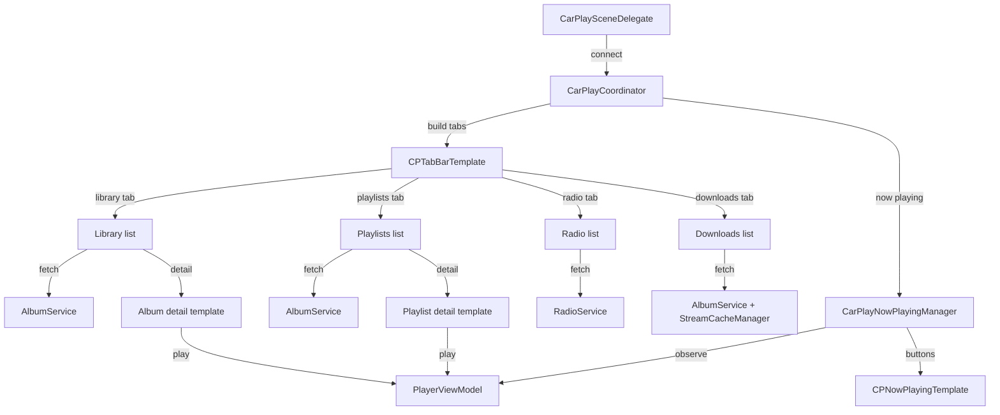

# CarPlay

**Active contributors:** rizaldy, docmeth02, Piekay, Francesco, faultables, SindreKjelsrud, Ed Poe, Simon Risse

**Purpose:** The CarPlay feature provides a safe, template-based interface for browsing the library and controlling playback while driving. It uses Apple's CarPlay framework to display albums, artists, songs, playlists, radios, and downloads, and hooks into the shared `PlayerViewModel` for playback.

## Directory layout

```
/home/exedev/flo/flo
└── CarPlay
    ├── CarPlaySceneDelegate.swift
    ├── CarPlayCoordinator.swift
    ├── CarPlayNowPlayingManager.swift
    └── CarPlayImageLoader.swift
```

It also depends on:

- `/home/exedev/flo/flo/Shared/Services/AlbumService.swift`
- `/home/exedev/flo/flo/Shared/Services/RadioService.swift`
- `/home/exedev/flo/flo/PlayerViewModel.swift`

## Key abstractions

| Type | File | Description |
|------|------|-------------|
| `CarPlaySceneDelegate` | `/home/exedev/flo/flo/CarPlay/CarPlaySceneDelegate.swift` | `CPTemplateApplicationSceneDelegate` that creates and tears down the coordinator when CarPlay connects. |
| `CarPlayCoordinator` | `/home/exedev/flo/flo/CarPlay/CarPlayCoordinator.swift` | Builds the tab bar, list templates, and detail templates for CarPlay. |
| `CarPlayNowPlayingManager` | `/home/exedev/flo/flo/CarPlay/CarPlayNowPlayingManager.swift` | Manages the shared `CPNowPlayingTemplate` and adds shuffle, heart, and repeat buttons. |
| `CarPlayImageLoader` | `/home/exedev/flo/flo/CarPlay/CarPlayImageLoader.swift` | Loads and resizes cover art for `CPListItem` images. |

## How it works

When CarPlay connects, `CarPlaySceneDelegate` creates a `CarPlayCoordinator` and calls `start`. The coordinator builds a `CPTabBarTemplate` with four tabs: Library, Playlists, Radio, and Downloads. Each tab is a `CPListTemplate` populated asynchronously from `AlbumService` or `RadioService`.

Tapping a list item pushes a detail template. For albums, artists, and playlists, the coordinator fetches the relevant songs or albums and builds a template with Play All and Shuffle actions plus a track list. Tapping a track or action starts playback through `PlayerViewModel` and then pushes the shared `CPNowPlayingTemplate`.

`CarPlayNowPlayingManager` observes `PlayerViewModel` state and updates the Now Playing template buttons. It adds a shuffle button, a heart button for starring the current track, and a repeat button. It also implements the Up Next button by showing a `CPListTemplate` of upcoming queue items.



## Tab structure

- **Library** — Lists Albums, Artists, Songs, and Liked Songs. Each entry pushes a dedicated list or detail template.
- **Playlists** — Lists all Navidrome playlists. Tapping a playlist shows its detail template with Play All and Shuffle.
- **Radio** — Lists all Navidrome radio stations. Tapping a station starts live radio playback.
- **Downloads** — Lists downloaded albums and a Cached songs section. Tapping an album opens the offline-aware detail template.

## Now playing template

`CarPlayNowPlayingManager` configures the shared `CPNowPlayingTemplate` with:

- A shuffle button that toggles `PlayerViewModel.shuffleCurrentQueue`.
- A heart button that toggles `PlayerViewModel.toggleStar`. For live radio this button is omitted.
- A repeat button that cycles through the playback modes.
- An Up Next button that shows a list of upcoming queue items and lets the user jump to a track.

The manager observes `isShuffling`, `playbackMode`, and `isStarred` to refresh the buttons in real time.

## Integration points

| Direction | What |
|-----------|------|
| Imports / calls | `AlbumService`, `RadioService`, `PlayerViewModel`, `StreamCacheManager`, `CarPlay` framework |
| Called by | `CarPlaySceneDelegate` when CarPlay connects or disconnects |
| Emits | CarPlay list templates and button updates |
| Listens to | `PlayerViewModel` published state changes |

## Entry points for modification

- To add or remove a tab, edit `CarPlayCoordinator.start` and adjust the `CPTabBarTemplate` templates array.
- To change the content of a list or detail template, edit the corresponding `make*` or `show*` method in `CarPlayCoordinator`.
- To change the Now Playing buttons, edit `CarPlayNowPlayingManager.updateButtons` and the observer extension.

## Key source files

| File | Responsibility |
|------|----------------|
| `/home/exedev/flo/flo/CarPlay/CarPlaySceneDelegate.swift` | Scene lifecycle and coordinator ownership. |
| `/home/exedev/flo/flo/CarPlay/CarPlayCoordinator.swift` | Tab bar, lists, detail templates, and playback routing. |
| `/home/exedev/flo/flo/CarPlay/CarPlayNowPlayingManager.swift` | Now Playing template configuration and buttons. |
| `/home/exedev/flo/flo/CarPlay/CarPlayImageLoader.swift` | Cover art loading and resizing for CarPlay. |
| `/home/exedev/flo/flo/Shared/Services/AlbumService.swift` | Library and offline data for CarPlay lists. |
| `/home/exedev/flo/flo/Shared/Services/RadioService.swift` | Radio station data for CarPlay. |
| `/home/exedev/flo/flo/PlayerViewModel.swift` | Playback engine used by CarPlay actions. |
