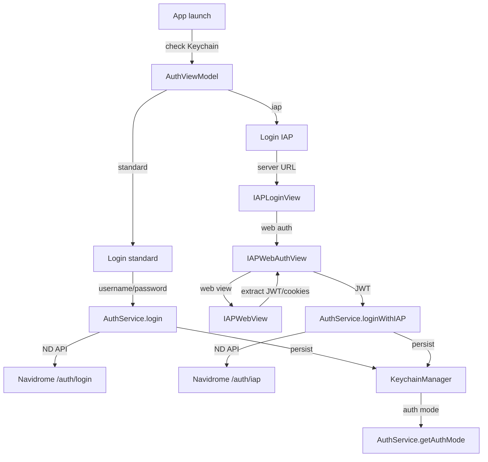

# IAP and authentication

**Active contributors:** rizaldy, docmeth02, Piekay, Francesco, faultables, SindreKjelsrud, Ed Poe, Simon Risse

**Purpose:** The authentication feature lets users log in to a Navidrome server using either standard username/password credentials or an IAP/OAuth2-Proxy flow. It stores credentials and authentication mode securely in the Keychain (or a file-backed store on Mac Catalyst) and restores the session on app launch.

## Directory layout

```
/home/exedev/flo/flo
├── AuthViewModel.swift
├── AuthMode.swift
├── LoginView.swift
└── Shared
    ├── Services
    │   ├── AuthService.swift
    │   └── KeychainManager.swift
    ├── Utils
    │   ├── IAPLoginView.swift
    │   ├── IAPWebAuthView.swift
    │   └── IAPWebView.swift
    └── Models
        └── UserAuth.swift
```

## Key abstractions

| Type | File | Description |
|------|------|-------------|
| `AuthViewModel` | `/home/exedev/flo/flo/AuthViewModel.swift` | Singleton view model that owns login state, form inputs, and persistence. |
| `AuthService` | `/home/exedev/flo/flo/Shared/Services/AuthService.swift` | Performs standard and IAP login, stores credentials, and builds the Subsonic token string. |
| `AuthMode` | `/home/exedev/flo/flo/AuthMode.swift` | Enum with `standard` and `iap` cases. |
| `IAPAuthInfo` | `/home/exedev/flo/flo/AuthMode.swift` | Codable struct holding the JWT assertion and optional user info. |
| `UserAuth` | `/home/exedev/flo/flo/Shared/Models/UserAuth.swift` | Codable model returned by Navidrome with token, salt, and Subsonic credentials. |
| `KeychainManager` | `/home/exedev/flo/flo/Shared/Services/KeychainManager.swift` | Secure credential storage using Keychain on iOS and a file-backed store on Mac Catalyst. |
| `Login` | `/home/exedev/flo/flo/LoginView.swift` | Standard login form with username, password, and server URL. |
| `IAPLoginView` | `/home/exedev/flo/flo/Shared/Utils/IAPLoginView.swift` | IAP login entry form with advanced settings. |
| `IAPWebAuthView` | `/home/exedev/flo/flo/Shared/Utils/IAPWebAuthView.swift` | Sheet that wraps the web view and completes the OAuth/IAP login. |
| `IAPWebView` | `/home/exedev/flo/flo/Shared/Utils/IAPWebView.swift` | `WKWebView` wrapper that extracts JWT and username from headers or cookies. |

## How it works

On launch, `AuthViewModel` checks `KeychainManager` for saved credentials. If the user previously opted to save login info, it restores the server URL, username, and password and attempts to log in. If the saved mode is `iap`, it restores the JWT assertion and calls `loginWithIAP`. Otherwise it uses the standard `login` path.

Standard login sends the username and password to the Navidrome native `/auth/login` endpoint. On success, `AuthService` stores the Navidrome token and the Subsonic salt/token parameters, and `AuthViewModel` persists the full `UserAuth` object to the Keychain.

IAP login is for servers protected by OAuth2-Proxy or an Identity-Aware Proxy. The user enters the server URL, optionally configures custom header or cookie names, and opens `IAPWebAuthView`. The web view loads the server URL, monitors HTTP responses and cookies, and extracts a JWT token and a username. The extracted JWT is then sent to a Navidrome `/auth/iap` endpoint to complete the session. The JWT and extracted username are stored as `IAPAuthInfo`.



## Standard login flow

1. `LoginView` collects server URL, username, and password.
2. `AuthViewModel.login` calls `AuthService.login`.
3. `AuthService` posts the credentials to the Navidrome login endpoint.
4. On success, `AuthService.setCreds` and `AuthService.setAuthMode(.standard)` are called.
5. `AuthViewModel.persistAuthData` stores the `UserAuth` JSON in the Keychain and updates `UserDefaultsManager.serverBaseURL`.

## IAP login flow

1. `LoginView` presents `IAPLoginView` from the "Login with IAP" button.
2. The user enters the server URL and optional advanced settings.
3. `IAPWebAuthView` loads `IAPWebView` with the server URL.
4. `IAPWebView.Coordinator` inspects HTTP response headers and cookies for a JWT token and username, using defaults for OAuth2-Proxy, Keycloak, and `x-auth-request-access-token` headers.
5. The extracted JWT is passed to `AuthService.loginWithIAP`, which posts it to `/auth/iap`.
6. On success, `IAPAuthInfo` and `AuthMode.iap` are stored in the Keychain.

## Secure storage

`KeychainManager` is the central credential store. On iOS it uses the `KeychainAccess` library. On Mac Catalyst, ad-hoc builds cannot access the system Keychain due to missing entitlements, so it falls back to a `FileBackedCredentialStore` that writes files with `0600` permissions in the app's Application Support directory. Stored items include:

- `authCreds` — encoded `UserAuth` JSON.
- `serverPassword` — the saved password when "Save login info" is enabled.
- `iapAuthInfo` — encoded `IAPAuthInfo`.
- `authMode` — `standard` or `iap`.

## Integration points

| Direction | What |
|-----------|------|
| Imports / calls | `AuthService`, `KeychainManager`, `UserDefaultsManager`, `Alamofire`, `Pulse`, `WebKit` |
| Called by | `App`, `HomeView`, `LoginView`, `IAPLoginView`, `IAPWebAuthView` |
| Emits | `@Published` user, login state, and alert messages |
| Listens to | Keychain restore on app launch |

## Entry points for modification

- To change the standard login UI, edit `LoginView.swift` and `AuthViewModel.login`.
- To change the IAP extraction rules or add a new OAuth provider, edit `IAPWebView.Coordinator`.
- To change how credentials are stored or encrypted, edit `KeychainManager` and `FileBackedCredentialStore`.

## Key source files

| File | Responsibility |
|------|----------------|
| `/home/exedev/flo/flo/AuthViewModel.swift` | Login state, persistence, and standard/IAP login orchestration. |
| `/home/exedev/flo/flo/AuthMode.swift` | `AuthMode` enum and `IAPAuthInfo` struct. |
| `/home/exedev/flo/flo/LoginView.swift` | Standard login form UI. |
| `/home/exedev/flo/flo/Shared/Services/AuthService.swift` | Standard and IAP login requests, credential mode storage. |
| `/home/exedev/flo/flo/Shared/Services/KeychainManager.swift` | Secure credential storage with Mac Catalyst fallback. |
| `/home/exedev/flo/flo/Shared/Utils/IAPLoginView.swift` | IAP login entry form and advanced settings. |
| `/home/exedev/flo/flo/Shared/Utils/IAPWebAuthView.swift` | Web auth sheet that completes the IAP flow. |
| `/home/exedev/flo/flo/Shared/Utils/IAPWebView.swift` | Web view that extracts JWT tokens and cookies. |
| `/home/exedev/flo/flo/Shared/Models/UserAuth.swift` | Navidrome auth response model. |
