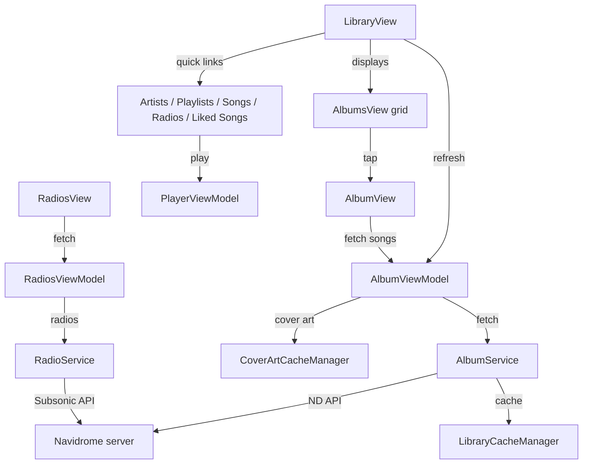

# Library browsing

**Active contributors:** rizaldy, docmeth02, Piekay, Francesco, faultables, SindreKjelsrud, Ed Poe, Simon Risse

**Purpose:** The library browsing feature lets users explore their Navidrome music collection. It includes a Home dashboard, a Library grid, dedicated lists for artists, albums, songs, playlists, and radios, plus quick links to liked songs and cached songs. Users can search within each list and pull to refresh the remote library.

## Directory layout

```
/home/exedev/flo/flo
├── Navigation
│   ├── HomeView.swift
│   ├── LibraryView.swift
│   ├── CachedSongsView.swift
│   └── LikedSongsView.swift
├── AlbumsView.swift
├── AlbumView.swift
├── AlbumViewModel.swift
├── Artists
│   ├── ArtistsView.swift
│   └── ArtistDetailView.swift
├── PlaylistView.swift
├── PlaylistDetailView.swift
├── SongsView.swift
├── SongView.swift
└── Radios
    ├── RadiosView.swift
    └── RadiosViewModel.swift
```

Services live in `/home/exedev/flo/flo/Shared/Services/`:

- `AlbumService.swift`
- `RadioService.swift`
- `LibraryCacheManager.swift`
- `CoverArtCacheManager.swift`
- `ScanStatusService.swift`

## Key abstractions

| Type | File | Description |
|------|------|-------------|
| `AlbumViewModel` | `/home/exedev/flo/flo/AlbumViewModel.swift` | Observable view model shared by the library, album detail, artist detail, and playlist views. |
| `Album` | `/home/exedev/flo/flo/Shared/Models/Album.swift` | Codable, `Playable` model for an album and its songs. |
| `Playlist` | `/home/exedev/flo/flo/Shared/Models/Playlist.swift` | Codable, `Playable` model for a Navidrome playlist. |
| `Artist` | `/home/exedev/flo/flo/Shared/Models/Artist.swift` | Artist model, used by artists and artist detail views. |
| `Song` | `/home/exedev/flo/flo/Shared/Models/Song.swift` | Track model, also used for downloads and caching. |
| `AlbumService` | `/home/exedev/flo/flo/Shared/Services/AlbumService.swift` | Singleton that fetches albums, artists, songs, playlists, and star status, and handles downloaded cover art. |
| `RadioService` | `/home/exedev/flo/flo/Shared/Services/RadioService.swift` | Fetches radio stations and similar/top songs for artist radio. |
| `LibraryCacheManager` | `/home/exedev/flo/flo/Shared/Services/LibraryCacheManager.swift` | File-based cache for albums, artists, playlists, and songs. |
| `CoverArtCacheManager` | `/home/exedev/flo/flo/Shared/Services/CoverArtCacheManager.swift` | Disk cache for album cover art. |
| `ScanStatusService` | `/home/exedev/flo/flo/Shared/Services/ScanStatusService.swift` | Reads server scan status and counts of downloaded records. |

## How it works

`LibraryView` is the main entry point. It renders a scrollable grid of albums and a set of quick links to Artists, Liked Songs, Playlists, Songs, and Radios. The view model fetches the album list, artist list, and playlist list from `AlbumService`, which in turn uses the Navidrome native API (`NDEndpointRequest`). The library caches each list on disk via `LibraryCacheManager` so the UI can show data immediately while refreshing in the background.

Tapping an album opens `AlbumView`, which sets the active album in `AlbumViewModel` and fetches the song list via `AlbumService.getSongFromAlbum`. Local songs are merged with remote songs so downloaded albums display correctly. `AlbumViewModel` also fetches album info, handles share links, and drives downloads/removal via `AlbumService` and `DownloadViewModel`.

Playlists, artists, and songs each have dedicated views that follow the same pattern: filter a local or fetched list, support search, and use the `PlayerViewModel` to start playback. The Radios view uses `RadiosViewModel` to fetch radio stations from `RadioService` and passes a selected station to `PlayerViewModel.playRadioItem`.



## Search and pull-to-refresh

Every list view has a searchable modifier. On `LibraryView`, pulling down triggers `refreshAlbums`, `refreshArtists`, and `refreshPlaylists`, which bypass the cache and store the new results. `SongsView` and `ArtistsView` have their own `refreshable` blocks that call the corresponding refresh methods on `AlbumViewModel`.

## Quick links

`LibraryView` shows quick links when `showQuickNavigation` is true or when the user toggles them. Each link is a `NavigationLink` that pushes the relevant view and fetches its data on appear. The Liked Songs and Cached Songs links are handled separately because their data is derived from star status and stream cache, not from the library cache.

## Integration points

| Direction | What |
|-----------|------|
| Imports / calls | `AlbumService`, `RadioService`, `LibraryCacheManager`, `CoverArtCacheManager`, `PlayerViewModel`, `DownloadViewModel`, `ScanStatusService` |
| Called by | `ContentView`, `HomeView`, `AlbumView`, `PlaylistDetailView`, `SongsView`, `ArtistDetailView`, `CarPlayCoordinator`, `WatchLibraryResponder` |
| Emits | `@Published` albums, artists, playlists, songs, starred songs, and errors |
| Listens to | `AuthViewModel.isLoggedIn` in `HomeView`; `PlayerViewModel.isStarred` in `LikedSongsView` |

## Entry points for modification

- To add a new library category or change caching, start in `AlbumViewModel` and `LibraryCacheManager`.
- To change the album grid or quick links layout, edit `LibraryView.swift` and `AlbumsView.swift`.
- To change how artist radio or top songs are fetched, modify `RadioService` and `ArtistDetailView`.

## Key source files

| File | Responsibility |
|------|----------------|
| `/home/exedev/flo/flo/Navigation/HomeView.swift` | Dashboard with login status and listening stats. |
| `/home/exedev/flo/flo/Navigation/LibraryView.swift` | Main library grid, quick links, search, and refresh. |
| `/home/exedev/flo/flo/AlbumsView.swift` | Album grid cell used in Library, Artist detail, and Downloads views. |
| `/home/exedev/flo/flo/AlbumView.swift` | Album detail with artwork, info, share, and song list. |
| `/home/exedev/flo/flo/AlbumViewModel.swift` | Shared view model for albums, artists, playlists, songs, and downloads. |
| `/home/exedev/flo/flo/Artists/ArtistsView.swift` | Artist list with search and filter. |
| `/home/exedev/flo/flo/Artists/ArtistDetailView.swift` | Artist biography, albums, radio, and top songs. |
| `/home/exedev/flo/flo/PlaylistView.swift` | Playlist list with search. |
| `/home/exedev/flo/flo/PlaylistDetailView.swift` | Playlist detail and per-track download context menu. |
| `/home/exedev/flo/flo/SongsView.swift` | All-songs list with search. |
| `/home/exedev/flo/flo/SongView.swift` | Reusable track list used by album and playlist detail. |
| `/home/exedev/flo/flo/Navigation/CachedSongsView.swift` | List of stream-cached songs. |
| `/home/exedev/flo/flo/Navigation/LikedSongsView.swift` | List of starred songs. |
| `/home/exedev/flo/flo/Radios/RadiosView.swift` | Radio station list. |
| `/home/exedev/flo/flo/Radios/RadiosViewModel.swift` | Fetches radio stations. |
| `/home/exedev/flo/flo/Shared/Services/AlbumService.swift` | Library data access and offline cover art. |
| `/home/exedev/flo/flo/Shared/Services/RadioService.swift` | Radio station and artist radio data. |
| `/home/exedev/flo/flo/Shared/Services/LibraryCacheManager.swift` | On-disk library cache. |
| `/home/exedev/flo/flo/Shared/Services/CoverArtCacheManager.swift` | Cover art disk cache. |
| `/home/exedev/flo/flo/Shared/Services/ScanStatusService.swift` | Server scan status and download counts. |
