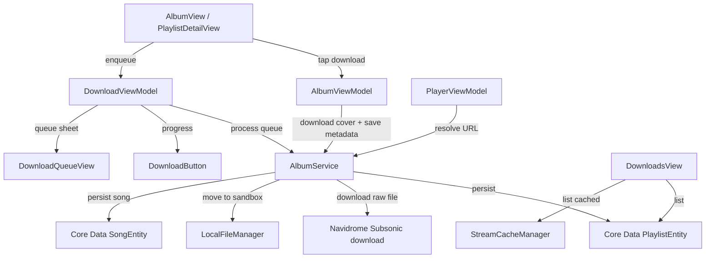

# Offline downloads

**Active contributors:** rizaldy, docmeth02, Piekay, Francesco, faultables, SindreKjelsrud, Ed Poe, Simon Risse

**Purpose:** The offline downloads feature lets users download albums, playlists, and individual songs so they can be played without a network connection. Downloads are stored in the app sandbox, tracked in Core Data, and surfaced in the Downloads tab.

## Directory layout

```
/home/exedev/flo/flo
├── DownloadViewModel.swift
├── DownloadButtonView.swift
├── DownloadQueueView.swift
├── Navigation
│   └── DownloadsView.swift
└── Shared
    ├── Services
    │   ├── AlbumService.swift
    │   ├── LocalFileManager.swift
    │   ├── CoreDataManager.swift
    │   └── StreamCacheManager.swift
    └── Models
        ├── Song.swift
        ├── Album.swift
        └── Playlist.swift
```

## Key abstractions

| Type | File | Description |
|------|------|-------------|
| `DownloadViewModel` | `/home/exedev/flo/flo/DownloadViewModel.swift` | Observable view model that owns the download queue and tracks progress for each item. |
| `DownloadItem` | `/home/exedev/flo/flo/DownloadViewModel.swift` | Queue item representing a single song download. |
| `DownloadTrackCount` | `/home/exedev/flo/flo/DownloadViewModel.swift` | Tracks per-album progress and total track count. |
| `DownloadButton` | `/home/exedev/flo/flo/DownloadButtonView.swift` | Circular progress/download indicator used in album and playlist toolbars. |
| `DownloadQueueView` | `/home/exedev/flo/flo/DownloadQueueView.swift` | Sheet showing active, completed, failed, and cancelled downloads. |
| `DownloadsView` | `/home/exedev/flo/flo/Navigation/DownloadsView.swift` | Tab showing downloaded albums and cached songs. |
| `AlbumService` | `/home/exedev/flo/flo/Shared/Services/AlbumService.swift` | Coordinates download requests, cover art downloads, and Core Data persistence. |
| `LocalFileManager` | `/home/exedev/flo/flo/Shared/Services/LocalFileManager.swift` | Moves, deletes, and resolves sandbox file URLs for downloaded media. |
| `CoreDataManager` | `/home/exedev/flo/flo/Shared/Services/CoreDataManager.swift` | Core Data access for `SongEntity`, `PlaylistEntity`, and `QueueEntity`. |
| `StreamCacheManager` | `/home/exedev/flo/flo/Shared/Services/StreamCacheManager.swift` | Caches played streams for quick replay and lists cached songs. |

## How it works

A download starts when the user taps the download button in `AlbumView` or `PlaylistDetailView`. The view calls `AlbumViewModel.downloadAlbum` or `downloadPlaylist`, which downloads the cover art first and then saves the album or playlist metadata to a `PlaylistEntity`. Then `DownloadViewModel.addItem` is called with the album or playlist to enqueue each song.

`DownloadViewModel` maintains a queue of `DownloadItem` objects and runs a limited number of concurrent downloads based on the active processor count. For each item it calls `AlbumService.downloadNew`, which uses Alamofire to download the raw song file from the Subsonic `download` endpoint. As the download progresses, `DownloadViewModel` updates the item progress and the per-album progress ring. When a download finishes, `AlbumService.saveDownload` stores a `SongEntity` record with metadata and a file path relative to the `Media` folder.

Playback is offline-aware: `AlbumService.getStreamUrl` checks `SongEntity` and `LocalFileManager` before falling back to remote or cached streams. The Downloads tab displays downloaded albums and a separate Cached section for songs that exist in the stream cache but were not explicitly downloaded.



## Download queue behavior

The queue limits concurrency to `ProcessInfo.processInfo.activeProcessorCount / 2`. Completed and cancelled items are periodically cleared to keep the queue small. Users can cancel an in-progress download, retry failed ones, or remove queued items from `DownloadQueueView`. Each `DownloadItem` tracks its own `DownloadStatus`: idle, queued, downloading, completed, failed, or cancelled.

## Offline playback

When the player asks for a stream URL, `AlbumService.getStreamUrl` looks in this order:

1. A local `SongEntity` whose `mediaFileId` matches and whose file exists on disk.
2. A ready entry in `StreamCacheManager` for the same media file and bit rate.
3. A remote Subsonic stream URL with the current transcoding settings.

This means downloaded content always takes precedence, cached content is used when available, and the network is only used as a last resort.

## Integration points

| Direction | What |
|-----------|------|
| Imports / calls | `AlbumService`, `LocalFileManager`, `CoreDataManager`, `StreamCacheManager`, `PlayerViewModel` |
| Called by | `AlbumView`, `AlbumViewModel`, `PlaylistDetailView`, `LibraryView`, `DownloadsView` |
| Emits | `@Published` download items, current downloads, and progress counts |
| Listens to | `downloadWatcher` to refresh the active album view after downloads complete |

## Entry points for modification

- To change the concurrent download limit or retry behavior, edit `DownloadViewModel.processQueue` and `startDownload`.
- To change where files are stored or how file paths are resolved, edit `LocalFileManager` and `AlbumService.saveDownload`.
- To add download progress indicators to another view, reuse `DownloadButton` and bind it to `DownloadViewModel`.

## Key source files

| File | Responsibility |
|------|----------------|
| `/home/exedev/flo/flo/DownloadViewModel.swift` | Download queue, concurrency, progress tracking, and retry logic. |
| `/home/exedev/flo/flo/DownloadButtonView.swift` | Circular download button and progress ring. |
| `/home/exedev/flo/flo/DownloadQueueView.swift` | Queue sheet UI. |
| `/home/exedev/flo/flo/Navigation/DownloadsView.swift` | Downloads tab showing downloaded albums and cached songs. |
| `/home/exedev/flo/flo/Shared/Services/AlbumService.swift` | Download orchestration, cover art, and Core Data persistence. |
| `/home/exedev/flo/flo/Shared/Services/LocalFileManager.swift` | File system operations inside the app sandbox. |
| `/home/exedev/flo/flo/Shared/Services/CoreDataManager.swift` | Generic Core Data access for all entities. |
| `/home/exedev/flo/flo/Shared/Services/StreamCacheManager.swift` | Stream cache used for playback and cached-song listing. |
| `/home/exedev/flo/flo/Shared/Models/Song.swift` | Track model with download and cache initializers. |
| `/home/exedev/flo/flo/Shared/Models/Album.swift` | Album model, including playlist-derived initializer. |
| `/home/exedev/flo/flo/Shared/Models/Playlist.swift` | Playlist model used for download conversion. |
