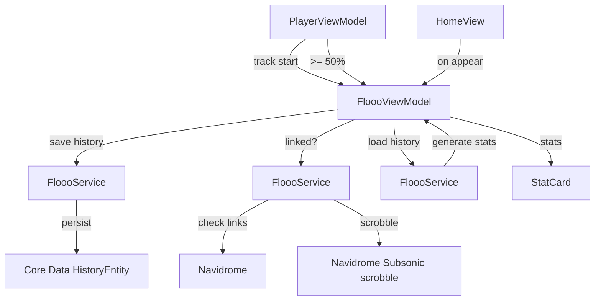

# Scrobbling and stats

**Active contributors:** rizaldy, docmeth02, Piekay, Francesco, faultables, SindreKjelsrud, Ed Poe, Simon Risse

**Purpose:** The scrobbling and stats feature records listening history on the device, generates a lightweight stats summary, and submits scrobbles to Last.fm or ListenBrainz through Navidrome. The Home dashboard displays the stats, and the Stats feature page exposes storage details and account link status.

## Directory layout

```
/home/exedev/flo/flo
├── FloooViewModel.swift
├── StatCardView.swift
├── Navigation/HomeView.swift
└── Shared
    ├── Services
    │   ├── FloooService.swift
    │   └── ScanStatusService.swift
    └── Models
        ├── Stats.swift
        ├── AccountLinkStatus.swift
        └── ScanStatus.swift
```

## Key abstractions

| Type | File | Description |
|------|------|-------------|
| `FloooViewModel` | `/home/exedev/flo/flo/FloooViewModel.swift` | Singleton view model that owns stats, listening history, local storage info, and scrobbling state. |
| `FloooService` | `/home/exedev/flo/flo/Shared/Services/FloooService.swift` | Reads `HistoryEntity` records, generates stats, checks account link status, and submits scrobbles. |
| `Stats` | `/home/exedev/flo/flo/Shared/Models/Stats.swift` | Simple model holding top artist, top album, and top album artist. |
| `AccountLinkStatus` | `/home/exedev/flo/flo/Shared/Models/AccountLinkStatus.swift` | Codable model with `listenBrainz` and `lastFM` booleans. |
| `ScanStatus` | `/home/exedev/flo/flo/Shared/Models/ScanStatus.swift` | Model for the Navidrome server scan status response. |
| `StatCard` | `/home/exedev/flo/flo/StatCardView.swift` | Reusable card view used on the Home dashboard for stats. |
| `HistoryEntity` | Core Data model | Entity that stores each played track with artist, album, and timestamp. |

## How it works

Every time a new track starts, `PlayerViewModel.setNowPlaying` calls `FloooViewModel.setNowPlayingToScrobbleServer`. That saves a `HistoryEntity` record and, if the user has linked a scrobbling account, sends a "now playing" scrobble through the Navidrome Subsonic `scrobble` endpoint with `submission: false`. Once playback passes 50 percent, `PlayerViewModel` triggers `FloooViewModel.scrobble`, which again saves a history record and sends a full submission with `submission: true` and the current timestamp.

`HomeView` calls `FloooViewModel.getListeningHistory` on appear. `FloooService.getListeningHistory` loads all `HistoryEntity` records in batches, `FloooService.generateStats` counts them off the main thread to produce the top artist and top album, and the result is published to `FloooViewModel.stats`. `HomeView` renders the stats with `StatCard` views.

Account link status is checked lazily. `FloooViewModel.fetchAccountLinkStatus` asks `FloooService` to check the Navidrome endpoints for ListenBrainz and Last.fm links. The result is cached in the view model so scrobbling decisions do not hit the network repeatedly.



## Stats generation

`FloooService.generateStats` runs on a detached task. It groups history entries by artist and by album/artist combination, counts occurrences, and returns the most frequent artist and album. The calculation is intentionally done off the main thread because `HistoryEntity` is a Core Data object.

## Local storage info

`FloooViewModel.getLocalStorageInformation` counts downloaded albums and songs via `ScanStatusService`, calculates the size of the `Media` folder using `LocalFileManager`, and reads the total stream cache size from `StreamCacheManager`. This is used on the stats/storage screen to show how much local storage is being used.

## Integration points

| Direction | What |
|-----------|------|
| Imports / calls | `FloooService`, `CoreDataManager`, `ScanStatusService`, `LocalFileManager`, `StreamCacheManager`, `APIManager` |
| Called by | `PlayerViewModel`, `HomeView`, stats/storage UI |
| Emits | `@Published` stats, total play count, scan status, account link status, and storage sizes |
| Listens to | `PlayerViewModel` playback progress and track changes |

## Entry points for modification

- To change when a scrobble is submitted, adjust the threshold in `PlayerViewModel` and the `scrobble`/`setNowPlayingToScrobbleServer` calls in `FloooViewModel`.
- To add new stats, extend `Stats` and update `FloooService.generateStats` and `HomeView`.
- To change the Home dashboard cards, edit `StatCardView` and `HomeView`.

## Key source files

| File | Responsibility |
|------|----------------|
| `/home/exedev/flo/flo/FloooViewModel.swift` | Stats, listening history, scrobbling, and storage info view model. |
| `/home/exedev/flo/flo/Shared/Services/FloooService.swift` | History persistence, stats generation, and scrobble submission. |
| `/home/exedev/flo/flo/StatCardView.swift` | Stat card UI component. |
| `/home/exedev/flo/flo/Shared/Models/Stats.swift` | Stats model. |
| `/home/exedev/flo/flo/Shared/Models/AccountLinkStatus.swift` | Last.fm and ListenBrainz link status. |
| `/home/exedev/flo/flo/Shared/Models/ScanStatus.swift` | Server scan status model. |
| `/home/exedev/flo/flo/Shared/Services/ScanStatusService.swift` | Counts downloaded records and fetches server scan status. |
| `/home/exedev/flo/flo/Navigation/HomeView.swift` | Dashboard that displays the stats cards. |
