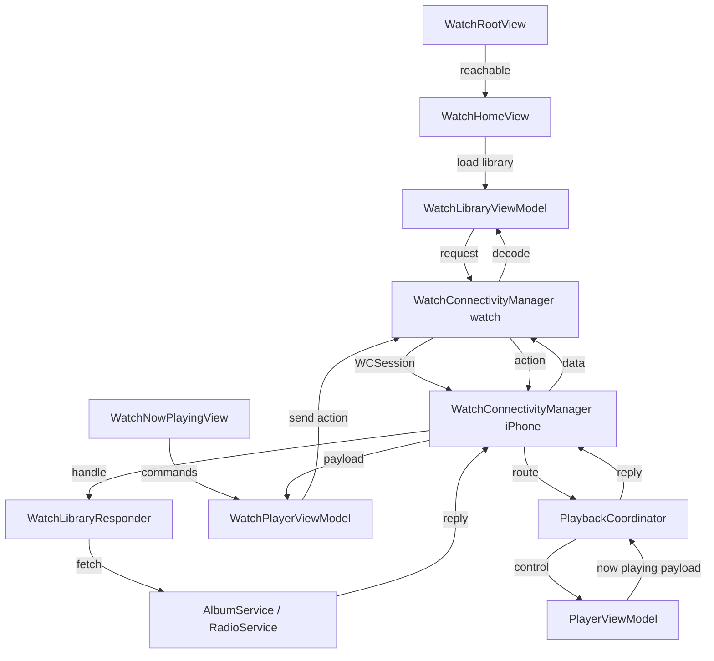

# Watch companion

**Active contributors:** rizaldy, docmeth02, Piekay, Francesco, faultables, SindreKjelsrud, Ed Poe, Simon Risse

**Purpose:** The watchOS companion app lets users browse their Navidrome library and control playback from an Apple Watch. The watch does not play audio directly; it sends commands to the iPhone over `WatchConnectivity`, and the iPhone runs the actual playback logic.

## Directory layout

```
/home/exedev/flo/flo
├── Watch
│   ├── FloWatchApp.swift
│   ├── WatchRootView.swift
│   ├── WatchHomeView.swift
│   ├── WatchLibraryViewModel.swift
│   ├── WatchPlayerViewModel.swift
│   ├── WatchNowPlayingView.swift
│   ├── WatchAlbumsView.swift
│   ├── WatchAlbumDetailView.swift
│   ├── WatchArtistsView.swift
│   ├── WatchArtistDetailView.swift
│   ├── WatchPlaylistsView.swift
│   ├── WatchPlaylistDetailView.swift
│   ├── WatchSongsView.swift
│   ├── WatchRadiosView.swift
│   └── WatchCoverArtView.swift
└── Shared
    └── Services
        ├── WatchConnectivityManager.swift
        ├── WatchLibraryResponder.swift
        └── PlaybackCoordinator.swift
```

## Key abstractions

| Type | File | Description |
|------|------|-------------|
| `WatchConnectivityManager` | `/home/exedev/flo/flo/Shared/Services/WatchConnectivityManager.swift` | Singleton `WCSessionDelegate` that sends and receives messages between the watch and the iPhone. |
| `WatchLibraryResponder` | `/home/exedev/flo/flo/Shared/Services/WatchLibraryResponder.swift` | iPhone-side handler that replies to watch library requests such as albums, artists, and songs. |
| `PlaybackCoordinator` | `/home/exedev/flo/flo/Shared/Services/PlaybackCoordinator.swift` | iPhone-side bridge between watch playback commands and `PlayerViewModel`. |
| `WatchLibraryViewModel` | `/home/exedev/flo/flo/Watch/WatchLibraryViewModel.swift` | Watch-side view model that requests library data from the iPhone. |
| `WatchPlayerViewModel` | `/home/exedev/flo/flo/Watch/WatchPlayerViewModel.swift` | Watch-side view model that sends playback commands and refreshes the current now-playing state. |
| `WatchRootView` | `/home/exedev/flo/flo/Watch/WatchRootView.swift` | Root view that shows the home UI when the iPhone is reachable and a fallback otherwise. |
| `FloWatchApp` | `/home/exedev/flo/flo/Watch/FloWatchApp.swift` | Watch app entry point. |

## How it works

When the watch app launches, `WatchRootView` checks whether the shared `WatchConnectivityManager` session is reachable. If not, it shows a "Open flo on your phone" prompt. If the iPhone is reachable, it presents `WatchHomeView`, which uses `WatchLibraryViewModel` to load albums, artists, playlists, songs, and radios.

All library data is fetched from the iPhone. The watch sends a message with a `request` key through `WatchConnectivityManager.requestLibrary`. On the iPhone, `WatchConnectivityManager` receives the message and forwards it to `WatchLibraryResponder`, which queries `AlbumService` or `RadioService` and replies with a JSON-encoded payload. The watch decodes the payload back into `Album`, `Artist`, `Playlist`, `Song`, or `Radio` models.

Playback commands such as play, pause, next, previous, and play album are sent from `WatchPlayerViewModel` to the iPhone via `WatchConnectivityManager.sendMessage`. The iPhone's `WatchConnectivityManager` forwards these action messages to `PlaybackCoordinator`, which builds the appropriate `Playable` item and calls `PlayerViewModel.addToQueue` or the transport methods.



## Watch library requests

`WatchLibraryResponder` handles these request types:

- `albums`, `artists`, `playlists`, `songs`, `radios` — return full lists.
- `albumSongs` and `playlistSongs` — return songs for a given ID.
- `artistAlbums` — return albums for an artist.
- `nowPlaying` — return the current playback state from `PlaybackCoordinator`.
- `serverStatus` — return whether the server is online via `ScanStatusService`.
- `ping` — simple connectivity check.

## Playback command mapping

`PlaybackCoordinator` maps watch actions to playback:

- `play`, `pause`, `next`, `previous` — direct `PlayerViewModel` calls.
- `playAlbum` — fetches album songs and plays the album.
- `playPlaylist` — fetches playlist songs and plays the playlist.
- `playSong` — plays a song within its album, playlist, or the all-songs list.
- `playRadio` — plays a live radio station.

## Integration points

| Direction | What |
|-----------|------|
| Imports / calls | `AlbumService`, `RadioService`, `ScanStatusService`, `PlaybackService`, `PlayerViewModel`, `WatchConnectivity` |
| Called by | `WatchRootView`, `WatchHomeView`, `WatchLibraryViewModel`, `WatchPlayerViewModel`, `WatchNowPlayingView` |
| Emits | `@Published` reachability, library arrays, and now-playing state |
| Listens to | `WCSession` activation and reachability changes |

## Entry points for modification

- To add a new library request type, add a case in `WatchLibraryResponder.handle` and a corresponding load method in `WatchLibraryViewModel`.
- To change how playback commands are interpreted on the iPhone, edit `PlaybackCoordinator.handleWatchCommand` and its helpers.
- To change the watch UI hierarchy, start with `WatchRootView` and `WatchHomeView`.

## Key source files

| File | Responsibility |
|------|----------------|
| `/home/exedev/flo/flo/Shared/Services/WatchConnectivityManager.swift` | Cross-device session management and messaging. |
| `/home/exedev/flo/flo/Shared/Services/WatchLibraryResponder.swift` | iPhone-side library request handler. |
| `/home/exedev/flo/flo/Shared/Services/PlaybackCoordinator.swift` | iPhone-side playback command bridge. |
| `/home/exedev/flo/flo/Watch/FloWatchApp.swift` | Watch app entry point. |
| `/home/exedev/flo/flo/Watch/WatchRootView.swift` | Reachability-based root view. |
| `/home/exedev/flo/flo/Watch/WatchLibraryViewModel.swift` | Watch-side library data loader. |
| `/home/exedev/flo/flo/Watch/WatchPlayerViewModel.swift` | Watch-side playback control. |
| `/home/exedev/flo/flo/Watch/WatchNowPlayingView.swift` | Watch now-playing UI. |
