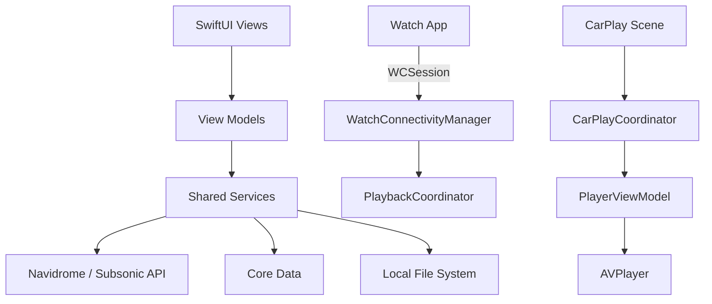

# Architecture

flo is a single SwiftUI app plus a Watch app target. The iOS app is the source of truth: the Watch app delegates playback and library requests to the phone over `WatchConnectivity`. The CarPlay scene runs the same player and service singletons that the main UI uses.

The overall architecture is pragmatic MVVM: SwiftUI views observe `ObservableObject` view models, and view models call shared service singletons. The project deliberately avoids heavy abstraction in favor of keeping the code readable for a small team. Core Data stores the offline library, playback queue, listening history, and stream cache metadata; UserDefaults stores preferences; Keychain (or a file-backed store on Catalyst) stores credentials.

## Major components

### UI layer (`flo/`)

- `App.swift` — app entry point; reconciles the stream cache on launch.
- `ContentView.swift` — root view with a `TabView` (or iPadOS 18 sidebar) containing Home, Library, Downloads, Preferences, and a Debug tab.
- `Navigation/*` — top-level screens: Home, Library, Downloads, Preferences, Liked Songs, Cached Songs.
- `PlayerView.swift` / `FloatingPlayerView.swift` — full-screen and mini player.
- `AlbumView.swift`, `AlbumsView.swift`, `SongView.swift`, etc. — library detail and list views.
- `LoginView.swift` / `IAPLoginView.swift` — standard and OAuth2-Proxy / Identity-Aware Proxy login.
- `Watch/*` — watchOS app views and view models.
- `CarPlay/*` — CarPlay scene, coordinator, and now-playing manager.

### Shared services (`flo/Shared/Services/`)

Singletons that most view models call directly:

- `AlbumService` — library metadata, downloads, cover art, share links, starring.
- `AuthService` — login, token storage, and standard vs. IAP auth mode.
- `APIManager` — all network requests through Alamofire, including Subsonic and Navidrome endpoints.
- `PlayerViewModel` — AVPlayer wrapper, playback controls, queue, lyrics, remote command center.
- `PlaybackService` — Core Data queue persistence and shuffling.
- `PlaybackCoordinator` — handles incoming playback commands from the Watch.
- `DownloadViewModel` — queued background downloads (located in `flo/` but shared with Library).
- `StreamCacheManager` — on-the-fly streaming cache with eviction.
- `CoreDataManager` — lightweight Core Data helper.
- `LocalFileManager`, `CoverArtCacheManager`, `LibraryCacheManager` — file and cache management.
- `WatchConnectivityManager` / `WatchLibraryResponder` — phone/watch communication.
- `InAppPurchaseManager` — flo+ subscription via StoreKit.
- `FloooService` / `FloooViewModel` — listening history, stats, account link status, scan status.

### Data models (`flo/Shared/Models/`)

- `Song`, `Album`, `Artist`, `Playlist`, `Radio` — Codable API models.
- `Playable` protocol — lets `PlayerViewModel` play albums, playlists, radio entities, and song collections uniformly.
- `Subsonic.swift` — generic Subsonic response wrapper and `SubsonicResponseData` protocol.
- `UserAuth`, `AuthMode`, `IAPAuthInfo` — authentication state and modes.
- `QueueEntity`, `SongEntity`, `PlaylistEntity`, `CacheEntity`, `HistoryEntity` — Core Data entities defined in `flo.xcdatamodeld`.

### Networking

The app talks to two API surfaces on the same server:

1. Navidrome native REST endpoints (`/api/*`) for login, albums, artists, songs, playlists, shares, and account link status.
2. Subsonic-compatible endpoints (`/rest/*`) for streaming, cover art, downloads, scrobbling, radio, and scan status.

`APIManager` uses one Alamofire `Session` with a retry policy. When debug mode is enabled, a `Pulse` `NetworkLogger` event monitor captures all traffic. Authentication is handled by `AuthService`, which stores a Navidrome JWT and a Subsonic token/salt string in the Keychain or file-backed store.

### Persistence

- `NSPersistentContainer` named `flo` for Core Data.
- Local downloaded music lives under the app's Documents directory in `Media/<Artist>/<Album>/`.
- Stream cache files live in `Caches/StreamCache` and are tracked by `CacheEntity`.
- Cover art and library metadata are cached under `Caches/CoverArtCache` and `Caches/LibraryCache`.
- Preferences and playback state go to `UserDefaults`.
- Credentials go to Keychain on iOS, or a `0600`-permissioned file-backed store on Mac Catalyst.

### Platform targets

- iOS / iPadOS / macOS Catalyst: the main app target (`flo`).
- watchOS: separate Watch app target (`flo Watch Watch App`) embedded in the iOS app.
- CarPlay: conditional `CarPlay` framework usage gated by `canImport(CarPlay)`.

## Cross-cutting concerns

- **Threading:** view models call services on background queues and dispatch UI updates to the main queue. Core Data operations are mostly on the main `viewContext`, with some batched background fetches and detached `Task.detached` for stats.
- **Error handling:** network errors are mapped to `AuthError.server(message:)` or `.unknown` by `ErrorHandler`. Many service calls propagate `Result` types up to the view models.
- **Security:** HTTP URLs are only allowed inside private IP ranges; public servers must use HTTPS. Credentials are stored in the Keychain, with a Catalyst fallback for unsigned local builds.
- **Offline support:** downloaded albums and playlists can be played without a network connection. The stream cache is optional and sized by user preference.
