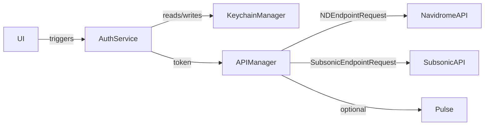

# Networking

Active contributors: rizaldy, docmeth02, Piekay, Francesco, faultables, SindreKjelsrud, Ed Poe, Simon Risse.

## Purpose

flo talks to a Navidrome server over two API surfaces: native Navidrome REST endpoints (Bearer token) and Subsonic-compatible endpoints (salted token query string). The `APIManager` provides a single Alamofire session for both, with shared retry policy and optional Pulse network logging.

## Directory layout

```
flo/Shared/Services/APIManager.swift
flo/Shared/Services/AuthService.swift
flo/Shared/Utils/Constants.swift
flo/Shared/Utils/Errors.swift
flo/Shared/Models/UserAuth.swift
flo/AuthMode.swift
```

## Key abstractions

| Type | What it is | Main responsibility |
| --- | --- | --- |
| `APIManager` | Singleton | Shared Alamofire session, retry policy, and request builders for Navidrome/Subsonic. |
| `NetworkLoggerEventMonitor` | `EventMonitor` | Forwards URLSession task events to Pulse when debug logging is enabled. |
| `AuthService` | Singleton | Holds `NDToken` and `subsonicParams` in memory, performs standard and IAP login. |
| `UserAuth` | `Codable` struct | Server response containing Navidrome token, Subsonic salt/token, and user profile. |
| `AuthMode` | `String` enum | `.standard` or `.iap`; determines which login flow is used. |
| `IAPAuthInfo` | `Codable` struct | Saved JWT assertion and extracted user identity for IAP mode. |
| `ErrorHandler` | Static helper | Maps Alamofire errors into `AuthError` and redacts passwords in debug logs. |
| `API` | Namespace in `Constants.swift` | Endpoint constants and auth headers. |

## How it works

When the app launches, `AuthService` restores credentials from the Keychain (or the Catalyst file-backed store). It builds the Subsonic query string once and stores it in `subsonicParams`; Navidrome calls use the bare `NDToken`. Both tokens are read from `AuthService` by `APIManager` on every request.



### Navidrome requests

`NDEndpointRequest` uses the endpoint path, parameters, and a `X-ND-Authorization: Bearer <NDToken>` header. It validates `200..<500` and decodes into the requested type.

### Subsonic requests

`SubsonicEndpointRequest` concatenates the endpoint path, the pre-built `subsonicParams` query string, and any caller parameters. Subsonic endpoints also validate `200..<500` and decode the response.

### Downloads

`SubsonicEndpointDownload` and `SubsonicEndpointDownloadNew` are used for song downloads, cover art, and stream cache fills. They call `session.download` with a 60-second timeout and a `validate()` step.

### Retry and logging

`createSession` builds a `RetryPolicy(retryLimit: 3)` and a `NetworkLoggerEventMonitor`. The monitor is only attached when `UserDefaultsManager.enableDebug` is true. The Pulse store is cleared every time the session is recreated. Debug logging can be toggled in `PreferencesView` and requires `APIManager.shared.reconfigureSession()` to take effect.

### Authentication modes

- **Standard**: username and password post to `/auth/login`. `AuthService.setAuthMode(.standard)` is called on success.
- **IAP**: an Identity-Aware Proxy (IAP) JWT assertion posts to `/auth/iap`. `AuthService.setAuthMode(.iap)` saves the JWT and extracted email/subject in `KeychainManager`.

## Integration points

- `AlbumService` is the main consumer for both ND and Subsonic endpoints.
- `StreamCacheManager`, `CoverArtCacheManager`, and `DownloadViewModel` use the Subsonic download helpers.
- `PlaybackCoordinator` builds cover art URLs using `AuthService.getCreds(key: "subsonicToken")`.
- `FloooViewModel` checks scan status via `ScanStatusService`, which uses Subsonic endpoints.

## Entry points for modification

- Add or change endpoint constants in `/home/exedev/flo/flo/Shared/Utils/Constants.swift`.
- Change timeout or retry policy in `APIManager.createSession` at `/home/exedev/flo/flo/Shared/Services/APIManager.swift`.
- Add a new service-level caller by reusing `NDEndpointRequest` or `SubsonicEndpointRequest`.
- Fix the repeated `getCreds(key: "subsonicToken")` refactor noted in the source (`FIXME: refactor getCreds` at lines 87, 100, 108, 136).
- Adjust password redaction in `AuthService.login` or `ErrorHandler` at `/home/exedev/flo/flo/Shared/Utils/Errors.swift`.

## Key source files

| File | What to look for |
| --- | --- |
| `/home/exedev/flo/flo/Shared/Services/APIManager.swift` | `NDEndpointRequest`, `SubsonicEndpointRequest`, `SubsonicEndpointDownloadNew`, `login`, `loginWithIAP`, `createSession`. |
| `/home/exedev/flo/flo/Shared/Services/AuthService.swift` | `setCreds`, `login`, `loginWithIAP`, JWT helpers, `subsonicParams` construction. |
| `/home/exedev/flo/flo/Shared/Utils/Constants.swift` | `API.NDEndpoint`, `API.SubsonicEndpoint`, `AppMeta.subsonicApiVersion`, `KeychainKeys.service`. |
| `/home/exedev/flo/flo/Shared/Utils/Errors.swift` | `ErrorHandler.handleFailure`, `AuthError`, password redaction. |
| `/home/exedev/flo/flo/Shared/Models/UserAuth.swift` | Fields returned by `/auth/login`. |
| `/home/exedev/flo/flo/AuthMode.swift` | `AuthMode` enum and `IAPAuthInfo` struct. |
