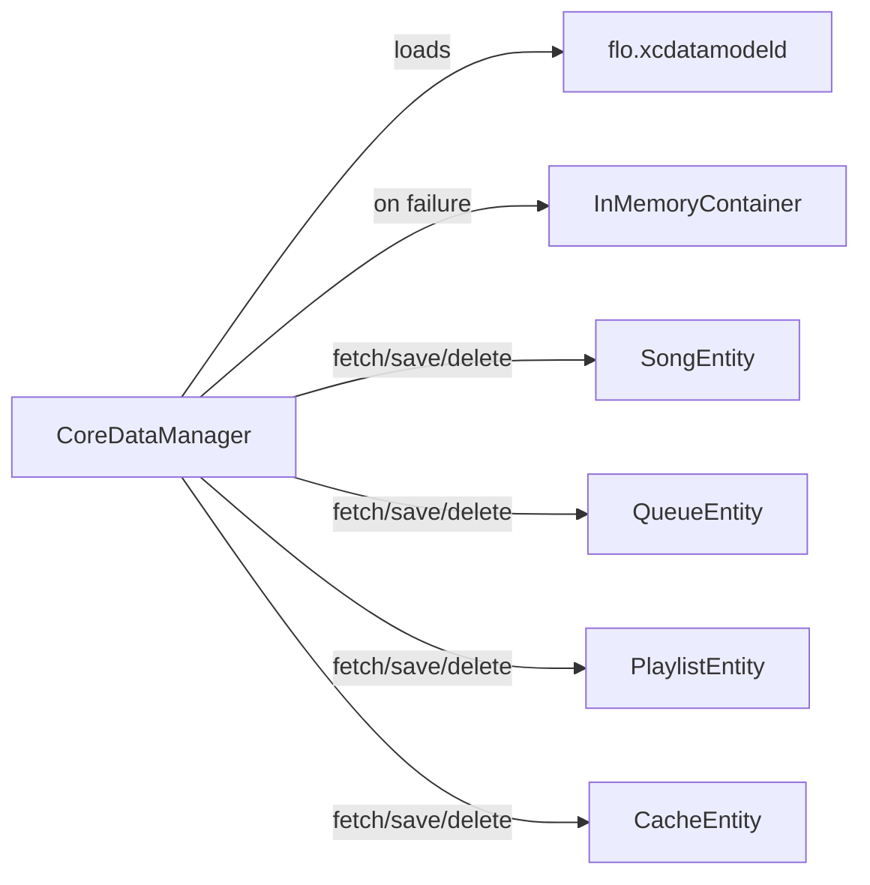

# Persistence

Active contributors: rizaldy, docmeth02, Piekay, Francesco, faultables, SindreKjelsrud, Ed Poe, Simon Risse.

## Purpose

flo stores three tiers of data: transient preferences in `UserDefaults`, sensitive credentials in the Keychain (with a file fallback on Mac Catalyst), and the offline library, playback queue, listening history, and stream cache metadata in Core Data. Downloads and cover art live on the local file system.

## Directory layout

```
flo/Shared/Services/CoreDataManager.swift
flo/Shared/Services/UserDefaultsManager.swift
flo/Shared/Services/KeychainManager.swift
flo/Shared/Services/LocalFileManager.swift
flo/Shared/Services/StreamCacheManager.swift
flo/Shared/Services/CoverArtCacheManager.swift
flo/Shared/Services/LibraryCacheManager.swift
flo/flo.xcdatamodeld/flo.xcdatamodel
```

## Key abstractions

| Type | What it is | Main responsibility |
| --- | --- | --- |
| `CoreDataManager` | Singleton `ObservableObject` | Loads the `flo` persistent container, provides fetch/save/delete helpers, and falls back to an in-memory store on load failure. |
| `UserDefaultsManager` | Static namespace | Typed accessors for `UserDefaults.standard`. |
| `KeychainManager` | Static namespace | Stores/retrieves credentials, passwords, and IAP auth info; uses `FileBackedCredentialStore` on Catalyst. |
| `FileBackedCredentialStore` | Catalyst-only class | Stores each credential as a file under `~/Library/Application Support/<bundle-id>/Credentials/` with `0600` permissions. |
| `LocalFileManager` | Singleton | Reads/writes files under `Documents/`, creates `Media/` directories, and calculates local storage size. |
| `StreamCacheManager` | Singleton | Manages `StreamCache/` files and `CacheEntity` records: download, lookup, eviction, and reconciliation. |
| `CoverArtCacheManager` | Singleton | Manages `CoverArtCache/*.img` files for album cover art. |
| `LibraryCacheManager` | Singleton | Saves/loads arbitrary JSON to `LibraryCache/*.json` for offline library snapshots. |
| `UserDefaultsKeys` | Constants enum | Keys for `UserDefaults`. |
| `KeychainKeys` | Constants enum | Service name and data keys for Keychain/file-backed store. |

## How it works

### Core Data

`CoreDataManager.persistentContainer` loads an `NSPersistentContainer` named `flo`. If the store fails to load, it returns an in-memory container so the app can still start. The view context merges changes from parent contexts automatically.



The main entities used are `QueueEntity` (current playback queue), `SongEntity` (downloaded tracks), `PlaylistEntity` (downloaded albums/playlists), and `CacheEntity` (stream cache metadata). `clearEverything()` deletes all records from these four entities.

### UserDefaults

`UserDefaultsManager` wraps `UserDefaults.standard` with typed properties. Values include server URL, queue index, playback progress, playback mode, debug flag, max bitrate, player background, login info flag, LRCLIB URL, `floPlus`, and stream cache size limit. Most writes are simple passthroughs; `playerBackground` ignores the stored value and always returns `translucent`.

### Keychain and file-backed store

On iOS, `KeychainManager` uses the `KeychainAccess` library with the service name `net.faultables.flo` (legacy, preserved to avoid logging users out on upgrade). On Mac Catalyst, the system Keychain returns `errSecMissingEntitlement` for non-sandboxed/ad-hoc builds, so `KeychainManager` uses `FileBackedCredentialStore` instead. The file store saves each credential under the app bundle's Application Support directory with `0600` permissions.

### Local file system

`LocalFileManager` resolves files under `Documents/`. Downloads are organized as `Media/<Artist>/<Album>/<track> <title>.<suffix>`. Cover art for downloads is stored at `Media/<Artist>/<Album>/cover.png` or `Media/Various Artists/<Album>/cover/<trackId>.png` for playlists. `moveFile(source:target:forceOverride:completion:)` creates parent directories and applies `completeUntilFirstUserAuthentication` protection.

### Caches

- **Stream cache**: `StreamCacheManager` stores files in `Caches/StreamCache/` and registers each file in `CacheEntity`. It downloads the next queued track after ten seconds of playback, deduplicates by `mediaFileId + bitrate`, and evicts least-recently accessed files when the configured limit is exceeded. `reconcile()` cancels in-flight downloads, deletes records whose files are missing, and removes orphan files.
- **Cover art cache**: `CoverArtCacheManager` downloads `getCoverArt` images into `Caches/CoverArtCache/<albumId>.img`.
- **Library cache**: `LibraryCacheManager` persists encoded JSON snapshots under `Caches/LibraryCache/<key>.json`.

## Integration points

- `PlayerViewModel` reads the saved queue and progress on launch and asks `PlaybackService` to persist the queue to Core Data.
- `AlbumService` looks up downloaded tracks in `SongEntity`, falls back to `StreamCacheManager.cachedFileURL`, and only then builds a remote stream URL.
- `DownloadViewModel` writes downloads through `AlbumService.saveDownload` and `LocalFileManager`.
- `FloooViewModel` exposes local storage size and stream cache size to `PreferencesView`.

## Entry points for modification

- Change the Core Data model in `/home/exedev/flo/flo/flo.xcdatamodeld` and update the lightweight-migration assumptions in `CoreDataManager`.
- Add new `UserDefaults` keys in `/home/exedev/flo/flo/Shared/Utils/Constants.swift` and typed accessors in `UserDefaultsManager`.
- Adjust the credential fallback or permissions in `KeychainManager` and `FileBackedCredentialStore` at `/home/exedev/flo/flo/Shared/Services/KeychainManager.swift`.
- Change the download path layout in `AlbumService.saveDownload` and `AlbumService.downloadNew`.
- Tune stream cache preloading, eviction, or reconciliation in `StreamCacheManager`.

## Key source files

| File | What to look for |
| --- | --- |
| `/home/exedev/flo/flo/Shared/Services/CoreDataManager.swift` | Container loading, fetch/save/delete helpers, `clearEverything()`. |
| `/home/exedev/flo/flo/Shared/Services/UserDefaultsManager.swift` | Typed `UserDefaults` accessors. |
| `/home/exedev/flo/flo/Shared/Services/KeychainManager.swift` | Keychain vs. file-backed store selection, `FileBackedCredentialStore` implementation. |
| `/home/exedev/flo/flo/Shared/Services/LocalFileManager.swift` | `Documents/` helpers, `Media/` directory creation, size calculation. |
| `/home/exedev/flo/flo/Shared/Services/StreamCacheManager.swift` | Cache lookup, download, eviction, `reconcile()`, and `clearCache()`. |
| `/home/exedev/flo/flo/Shared/Services/CoverArtCacheManager.swift` | Cover art download and cache lookup. |
| `/home/exedev/flo/flo/Shared/Services/LibraryCacheManager.swift` | JSON save/load under `LibraryCache/`. |
| `/home/exedev/flo/flo/flo.xcdatamodeld/flo.xcdatamodel` | Core Data schema for `SongEntity`, `QueueEntity`, `PlaylistEntity`, `CacheEntity`. |
| `/home/exedev/flo/flo/Shared/Utils/Constants.swift` | `UserDefaultsKeys`, `KeychainKeys`, `TranscodingSettings`. |
