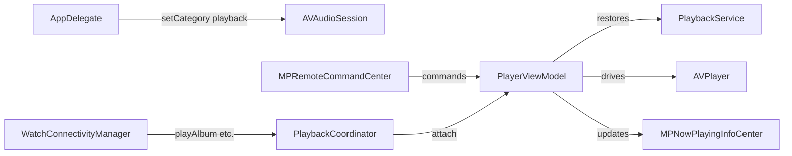

# Player engine

Active contributors: rizaldy, docmeth02, Piekay, Francesco, faultables, SindreKjelsrud, Ed Poe, Simon Risse.

## Purpose

`PlayerViewModel` wraps `AVPlayer` and owns the playback queue, remote command center bindings, Now Playing metadata, audio session routing, and scrobbling hooks. It is the single source of truth for "what is playing now" across iOS, iPadOS, macOS Catalyst, Apple Watch, and CarPlay.

## Directory layout

```
flo/PlayerViewModel.swift
flo/Shared/Services/PlaybackService.swift
flo/Shared/Services/PlaybackCoordinator.swift
flo/AppDelegate.swift
```

## Key abstractions

| Type | What it is | Main responsibility |
| --- | --- | --- |
| `PlayerViewModel` | Singleton `ObservableObject` | Wraps `AVPlayer`, manages queue, playback state, remote commands, lyrics, and scrobbling. |
| `PlaybackService` | Singleton | Persists queue to `QueueEntity` and reconstructs `QueueEntity` arrays from any `Playable` item. |
| `PlaybackCoordinator` | Singleton | Bridges `PlayerViewModel` with incoming playback requests from the Apple Watch. |
| `QueueEntity` | Core Data entity | Current queue item: IDs, metadata, and local/offline flags. |
| `Playable` | Protocol | Implemented by `Album`, `Playlist`, and `Radio` so they can all be turned into a queue. |
| `MPNowPlayingInfoCenter` | MediaPlayer framework | Lock screen / control center metadata and playback state. |
| `MPRemoteCommandCenter` | MediaPlayer framework | Physical and on-screen remote control commands. |
| `AVAudioSession` | AVFoundation | Playback category, activation, and route change handling. |

## How it works

On launch, `PlayerViewModel` initializes `AVPlayer`, restores the last queue from `PlaybackService`, and binds the remote command center. `AppDelegate` sets the audio session category to `.playback` before anything else.



### Queue lifecycle

1. The UI calls `playBySong`, `playItem`, `playRadioItem`, `shuffleItem`, or `playFromQueue`.
2. `PlayerViewModel` asks `PlaybackService` to translate the `Playable` into `QueueEntity` rows via `NSBatchInsertRequest`.
3. `PlayerViewModel` sets `activeQueueIdx` and calls `setNowPlaying(playAudio:)`.
4. `setNowPlaying` resolves the stream URL (local download, stream cache, or remote), builds an `AVPlayerItem`, and starts playback.
5. A periodic time observer fires every second, updating progress, the lock screen, lyrics, scrobbling at the 50% mark, and stream-cache preloading at the 10-second mark.
6. When the track ends, `nextSong()` advances the queue according to `playbackMode`.

### Playback modes

`UserDefaultsManager.playbackMode` stores one of three values:

- `default`: play through the queue and stop at the end.
- `repeatAlbum`: wrap from the last track back to the first.
- `repeatOnce`: restart the current track.

`setPlaybackMode()` cycles through the modes in that order.

### Remote command center and Now Playing

`setupRemoteCommandCenter()` enables play, pause, next, previous, and change-playback-position. `initNowPlayingInfo()` sets title, artist, duration, and artwork. `updateNowPlayingInfo()` keeps elapsed time and rate in sync. Artwork is resolved from local cover art first, then remote URL, with a fallback placeholder for radio.

### Audio session and routing

`AppDelegate` sets `AVAudioSession.Category.playback`. `PlayerViewModel` observes interruption and route-change notifications, pausing on interruption and resuming when appropriate. `externalOutputName` is populated by inspecting the current audio route.

### Apple Watch integration

`PlaybackCoordinator` is a weak bridge: `WatchConnectivityManager` forwards messages such as `play`, `pause`, `next`, `previous`, `playAlbum`, `playPlaylist`, `playSong`, and `playRadio` to `PlayerViewModel`. `PlayerViewModel` itself is a singleton, so the coordinator attaches to the shared instance.

## Integration points

- `AlbumService.getStreamUrl` resolves which audio URL to play: local download, stream cache, or remote Subsonic stream.
- `StreamCacheManager` preloads the next track after ten seconds of playback.
- `FloooViewModel` receives scrobble submissions and "now playing" pings at the 50% threshold.
- `LRCLIBService` and `LRCParser` provide synced lyrics when a LRCLIB server is configured.
- `AlbumService` is queried for star status and toggled via `toggleStar`.

## Entry points for modification

- Change the audio session category in `AppDelegate.application(_:didFinishLaunchingWithOptions:)` at `/home/exedev/flo/flo/AppDelegate.swift`.
- Change queue restoration, playback modes, or remote control behavior in `PlayerViewModel` at `/home/exedev/flo/flo/PlayerViewModel.swift`.
- Change how queue items are persisted in `PlaybackService.addToQueue` at `/home/exedev/flo/flo/Shared/Services/PlaybackService.swift`.
- Add new watch commands in `PlaybackCoordinator.handleWatchCommand` and `WatchConnectivityManager`.
- Change Now Playing artwork resolution in `PlayerViewModel.makeNowPlayingArtwork()`.

## Key source files

| File | What to look for |
| --- | --- |
| `/home/exedev/flo/flo/PlayerViewModel.swift` | `setNowPlaying`, `nextSong`, `prevSong`, `playItem`, `setupRemoteCommandCenter`, `addPeriodicTimeObserver`, `_playFromLocal`. |
| `/home/exedev/flo/flo/Shared/Services/PlaybackService.swift` | `addToQueue`, `getQueue`, `shuffleQueue`, `clearQueue`. |
| `/home/exedev/flo/flo/Shared/Services/PlaybackCoordinator.swift` | `attach`, `handleWatchCommand`, `play(item:startIndex:)`, `currentNowPlayingPayload`. |
| `/home/exedev/flo/flo/AppDelegate.swift` | Audio session category setup, `WatchConnectivityManager` start. |
